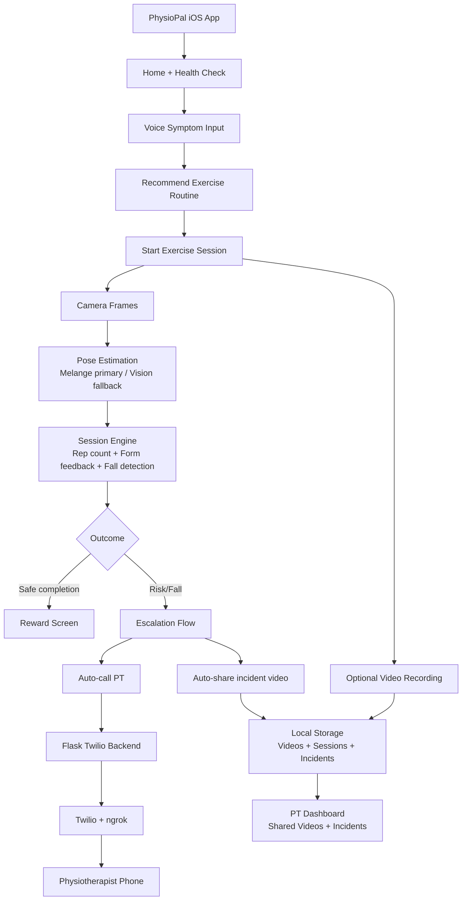

# PhysioPal Architecture Diagram

```mermaid
flowchart TD
    A[PhysioPal iOS App] --> B[Home + Health Check]
    B --> C[Voice Symptom Input]
    C --> D[Recommend Exercise Routine]
    D --> E[Start Exercise Session]

    E --> F[Camera Frames]
    F --> G[Pose Estimation\nMelange primary / Vision fallback]
    G --> H[Session Engine\nRep count + Form feedback + Fall detection]

    H --> I{Outcome}
    I -->|Safe completion| J[Reward Screen]
    I -->|Risk/Fall| K[Escalation Flow]

    E --> L[Optional Video Recording]
    L --> M[Local Storage\nVideos + Sessions + Incidents]

    K --> N[Auto-share incident video]
    N --> M
    K --> O[Auto-call PT]
    O --> P[Flask Twilio Backend]
    P --> Q[Twilio + ngrok]
    Q --> R[Physiotherapist Phone]

    M --> S[PT Dashboard\nShared Videos + Incidents]
```
